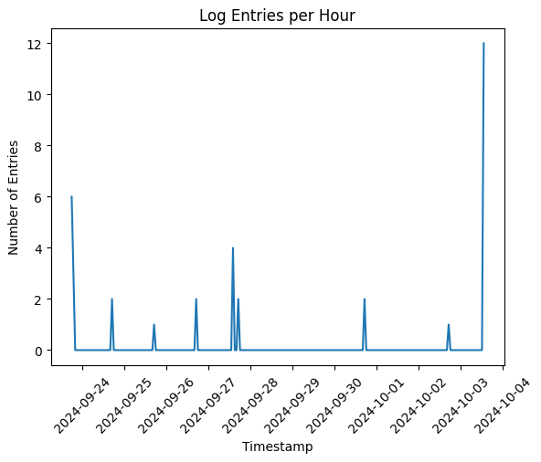

# Data Analysis and Log Monitoring of Clash of Clans War Data

### Overview

I created this program to allow clan members to access current war stats easily and visualize trends within our clan. I chose to utilize Pandas for data manipulation and chart creation, giving insight 
into player performance.bAn example chart with war data is shown below.

In a war, each member can attack up to two times and can get up to 200% destruction and 6 stars total. I created custom columns by manipulating the JSON response provided by the official Clash of Clans API
to better show relevant stats for each member. Flattening the data allowed for the creation of a double-indexed DataFrame, to show the different stats for each attack. Additionally, the chart automatically 
color codes people as either red, yellow, or green, based on their number of completed attacks, making it easy to determinewho needs to be reminded to play. 

I have set up a CRON task to run the script once a day, collecting relevant information and logging the event. I also created a script that allows for easily exporting the JSON response as an Excel table, as
this is what my leader and clanmates prefer, or I can perform further analysis with Pandas.

I also wanted to visualize the log data, and check for any errors. So I wrote another script to analyze this data and some of the results are shown below. There is a histogram showing the distribution of log 
entries. A logs/hour chart to look at frequency, and a graph that shows the breakdown of message types (although there aren't any error messages yet).

  
